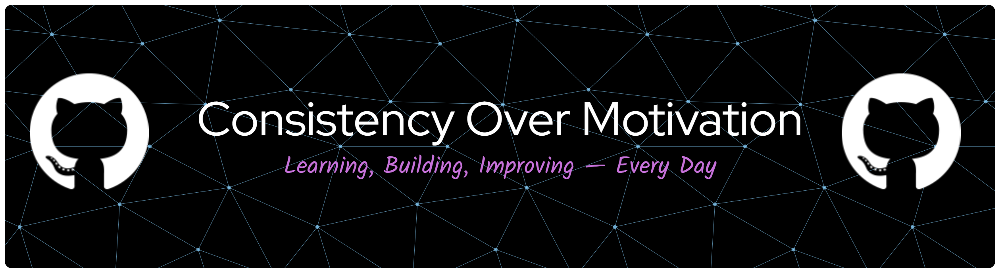

  

> **Halo! Saya Febrian Yosi Pangestu** 👋
>
> Seorang **Junior Developer** yang antusias dalam dunia Software Engineering. Saya fokus menulis kode yang **bersih, efisien, dan modern**. Selalu semangat mempelajari teknologi terbaru untuk menciptakan solusi digital yang bermanfaat. Saat ini, saya sedang aktif membangun berbagai proyek untuk mempertajam *skill* teknis dan logika pemrograman saya.

### 🌐 Social Media

  
  

 

###  My Portfolio

###  Tech Stack

  
  
  
  
  
  
  
  
  
  
  
  
  

###  Contribution

<picture>
  <source media="(prefers-color-scheme: dark)" srcset="https://raw.githubusercontent.com/aizenstack/aizenstack/output/pacman-contribution-graph.svg">
  <source media="(prefers-color-scheme: light)" srcset="https://raw.githubusercontent.com/aizenstack/aizenstack/output/pacman-contribution-graph.svg">
  
</picture>

  

